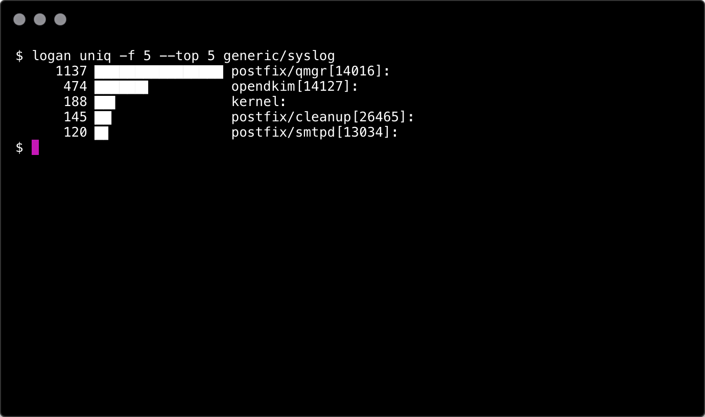
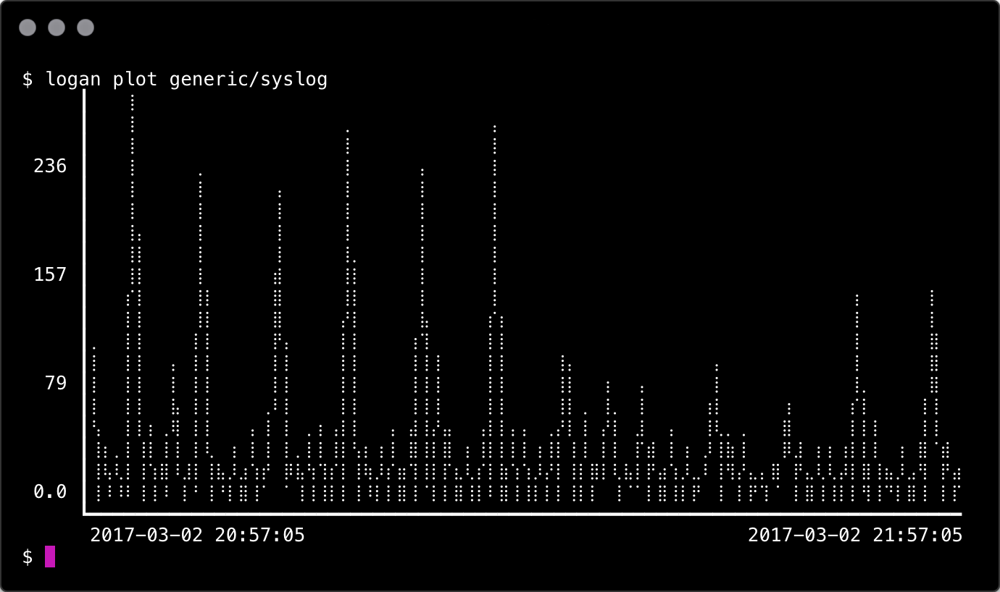

# logan

Terminal-based tool for analyzing logs on the fly.

## Usage

    logan list [query]
    logan (inspect|show|uniq|plot) [options] <category> [filter]

### Log categories

The `list` subcommand can be used to list all available log categories. Categories are organized into groups, based on their sources, the currently supported groups are:

- `generic/*` - logs found in `/var/log`
- `scribe/*` - Scribe-style logs, found in `/mnt/scribe` and `/var/log/scribe` by default
- `stdin/-` - logs read from standard input

Commands accept the full name (e.g. `generic/system`) or category only, if it's not ambiguous (e.g. `system`). Currently short versions of categories containing the `/` character are not supported.

### Generic options for parsing commands

These options can be used to every commands but `list`. Well, there are some exceptions, see the descriptions for details.

#### --help

Shows possible options for each commands.

#### -t TIME_INTERVAL (time interval specifier)

This option is a bit tricky, but one of the most important one, it's good to understand how it works. It consists of 3 components: reference time, negative offset, positive offset.

The reference time is the exact time in the format HH:MM or HH:MM:SS, it's the current date if omitted. It is followed by the negative offset, a duration string which moves the beginning of the interval back relatively from the reference. If omitted, is `-1h`. Then the positive offset is another duration, which defines the length of the time interval from the beginning (marked by the reference time and the negative offset). It'll be the current time if omitted.

Duration is a string of concatenated numbers and suffices. The supported suffices are `s` (second), `m` (minute), `h` (hour), `d` (day) and `w` (week). Micro- and nanoseconds are supported as well (`ms` and `ns` respectively), but they are not really useful (the implementation is a modified version of Golang's `ParseDuration`, extended with support for weeks)

Example time intervals:

- `-3h5m`: the last 3 hours and 5 minutes (from `-3h5m` to now)
- `-1w`: the last week (168 hours)
- `18:00`: since the last 18:00 (e.g. 5 minutes when executed at 18:05, 23 hours and 55 minutes when executed at 17:55)
- `12:00+5m`: from the last 12:00 to the following 12:05
- `12:00-1w+5m`: the same but one week earlier

#### -f FIELDS (field specifier)

When set, only the specified fields will show up in the output. Particularly useful for the command `uniq`. It can be used for every command except `list` and `except`.

Fields are parsed with a simple algorithm, strings between quotes (`""`), apostrophes (`''`), brackets (`[]`), parentheses (`()`) are considered one field. If not quoted, fields are strings separated by multiple tabs or spaces (in any combination). The output (even for `show`) omits multiple spaces, so the fields will always be separated by a single space.

Fields can be specified one by one (e.g. `1,2,5,7,2`) or in ranges (`1-8,3,4-6`).

### Commands

#### logan inspect (for inspecting fields)

Prints the first five lines that matches the filters and time specifiers. First the whole line, then separated to fields, wit every fields marked with their number. Useful to write filters.

Example:

    $ logan inspect generic/syslog
    Line: Mar  2 20:31:01 servername CRON[27049]: (www-data) CMD (/usr/local/bin/some_cronjob.sh )
       1: Mar
       2: 2
       3: 20:31:01
       4: servername
       5: CRON[27049]:
       6: (www-data)
       7: CMD
       8: (/usr/local/bin/some_cronjob.sh )

### logan show (displays parsed and re-joined log lines)

The main purpose of this command is to inspect the log lines themselves and to be able to feed the filtered output to other commands (e.g. `less`/`vim` for viewing/further processing).

The following command will show log lines from /var/log/syslog for the last hour.

    # logan show generic/syslog

### logan uniq (to replace sort-uniq-sort pipes)

This command can show a summary of the log by counting unique lines and showing them with nice unicode bar of ratio.

`-top` is an additional option that only makes sense here, it specifies the top N hits in `uniq`'s output.

Example:

The above command counts the unique number lines grouped by field 5 from the last hour's data of `/var/log/syslog`.

### logan plot (creates a textual chart of the log data)

Based on the current filters and time specifier, this command draws up a single chart based on your terminal's dimensions (using 80x25 by default if it cannot be determined).

Example:

